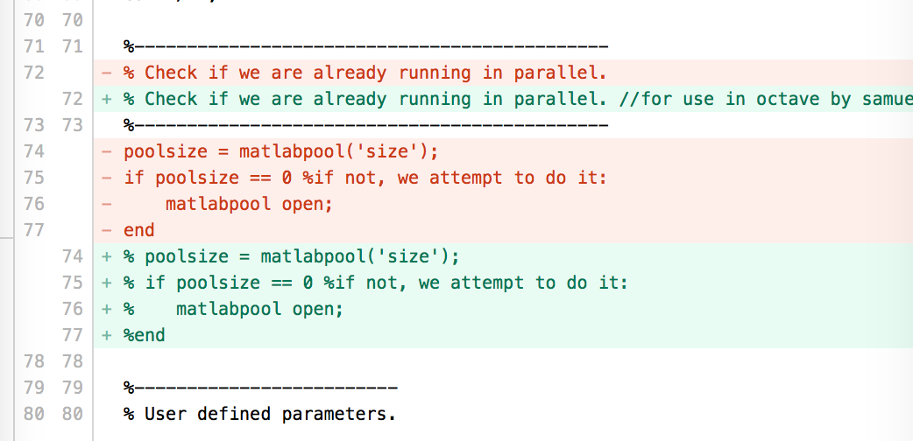
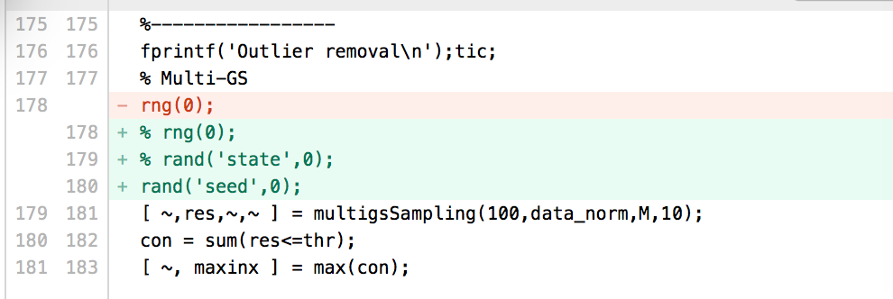
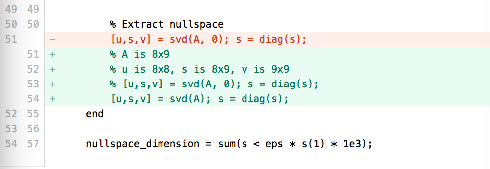
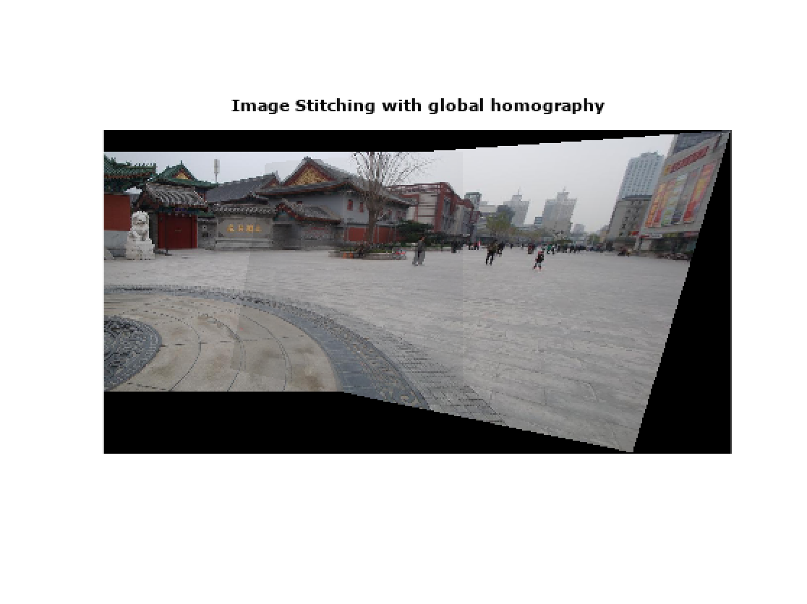

# soccercv


## 1. 在mac上面搭建open cv的开发环境

### 1.1 现有的环境

python --version: Python 2.7.10
which python: /usr/bin/python


python3 --version: Python 3.5.0
which python3: /usr/local/bin/python3

### 1.2 open cv的示例需要哪个版本?

没看出来哪个版本(结果参考下面的文档可同时安装两个版本)

### 1.3 参考资料

http://www.pyimagesearch.com/2016/12/19/install-opencv-3-on-macos-with-homebrew-the-easy-way/

### 1.4 错误处理

最后还是不行, 报错: "No module named 'cv2'""

echo $PATH发现我的python3有两个路径, 把其中的/Library/Frameworks/Python.framework/Versions/3.5/lib/python3.5路径去掉就好了(注意: 开始我没发现, 又pip3 install opencv-python了一下, 结果运行报告"highgui/src/window.cpp error: (-2) The function is not implemented"错误, 后来找到路径错误, 运行pip3 uninstall opencv-python才可以工作了)

## 2. 用APAP进行图像拼接
参考知乎大神[YaqiLYU的文章](
https://www.zhihu.com/question/34535199)
下载了[APAP(As Projective As Possible)](https://cs.adelaide.edu.au/~tjchin/apap/)的源代码, 发现在我的开发环境下(Mac + octave)跑不起来, 答应我家旦旦要给他做一个有两个旦旦画画的图片, 于是折腾了两个早上, 总算跑起来了, 效果不错.解决的问题有如下几个:

### 2.1 octave对matlib兼容问题

matlabpool在octave中不支持, 应该是有其他的方式, 我这里直接注释掉



rng(0)也有同样的问题, 换成了rand('seed', 0)



svd(A)的精简版本svd(A, 0)在octave中有问题, 直接换成了svd(A), 不用精简版本.


### 2.2 缺少包的问题
```
error: 'randsample' undefined
```

需要安装image和statistics库.
```
pkg install -forge statistics
pkg install -forge image
```
然后在进入octave之后, 加载image和statistics库:
```
octave:1>pkg load image
octave:2>pkg load statistics
```
再运行main.
```
octave:3>main
```
这样就跑通了, 可以看到效果如图.

### 2.3 拼接自定义的图片
demo中的图片是直接读取matlib的mat数据文件, 可是我需要拼接自己的图片, 需要修改下面这个地方, main.m文件中已经写好了.只要注释掉上面的部分, 打开下面的部分就可以了.


注意加载的路径:
```
images/case26/4.JPG
images/case26/5.JPG
```
换成自己要拼接的图片路径.

再运行main, 会报错:
```
Keypoint detection and matching...error: invalid use of script /xxx/./vlfeat-0.9.14/toolbox/sift/vl_sift.m in index expression
```

查看对应目录下的vl_sift.m文件确实都是注释没有代码, 原因是拼接自己的图片需要使用vlfeat库, 而vlfeat库没有安装好(如果安装好, 会调用编译好的mex文件而不是这个源文件).

### 2.4 编译vlfeat

那就为mac + octave环境编译vlfeat吧, 进入vlfeat-0.9.14目录, 执行make:
```
make MKOCTFILE=/usr/local/bin/mkoctfile ARCH=maci64
```

提示路径不对: /Developer/SDKs/MacOSX10.7.sdk

修改Makefile把这个路径改成本地的XCode的路径
:
```
/Applications/Xcode.app/Contents/Developer/Platforms/MacOSX.platform/Developer/SDKs/MacOSX.sdk
```
再进行编译, 提示链接错误:

```
make: *** [toolbox/mex/octave/vl_siftdescriptor.mex] Error 1
```
然后各种google都没有成功, 自己去[vlfeat官网](http://www.vlfeat.org/download.html)下载了最新的0.9.21版本, 再进行编译安装:
```
make MKOCTFILE=/usr/local/bin/mkoctfile ARCH=maci64
```
报错:
```
cp: toolbox/mex/octave/mexmaci64/libvl.dylib: No such file or directory
```
我不知道该怎么在Makefile里面创建目录, 那就手动创建目录好了:
```
mkdir toolbox/mex
mkdir toolbox/mex/octave
mkdir toolbox/mex/octave/mexmaci64
```

再编译报错:


toolbox/mexutils.h:33:22: error: typedef redefinition with different types
      ('unsigned int' vs 'int')

修改mexutils.h中的定义, 把int unsigned改成int, 再编译安装, 终于成功了!!!


