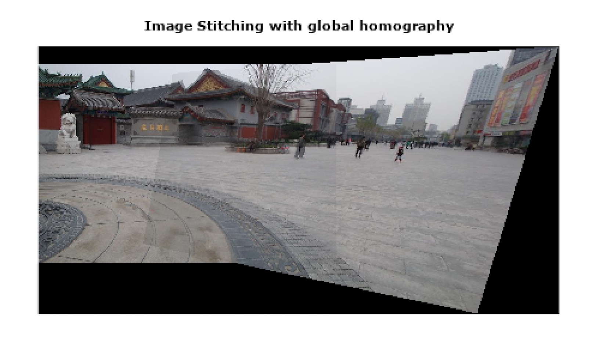
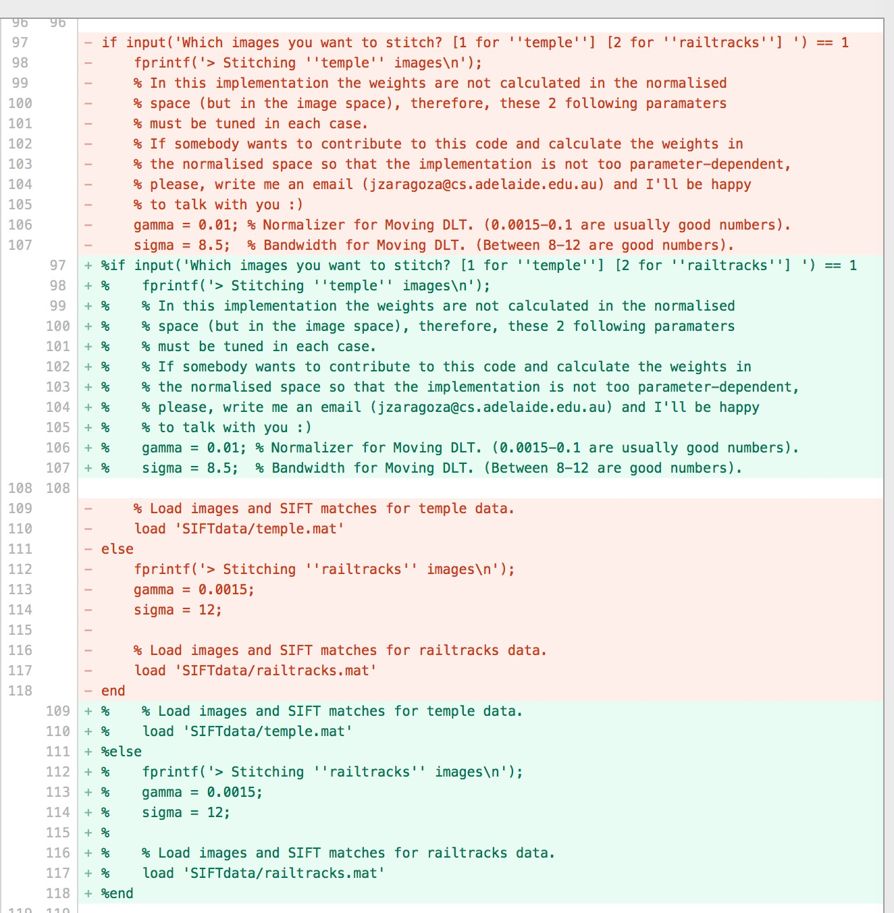
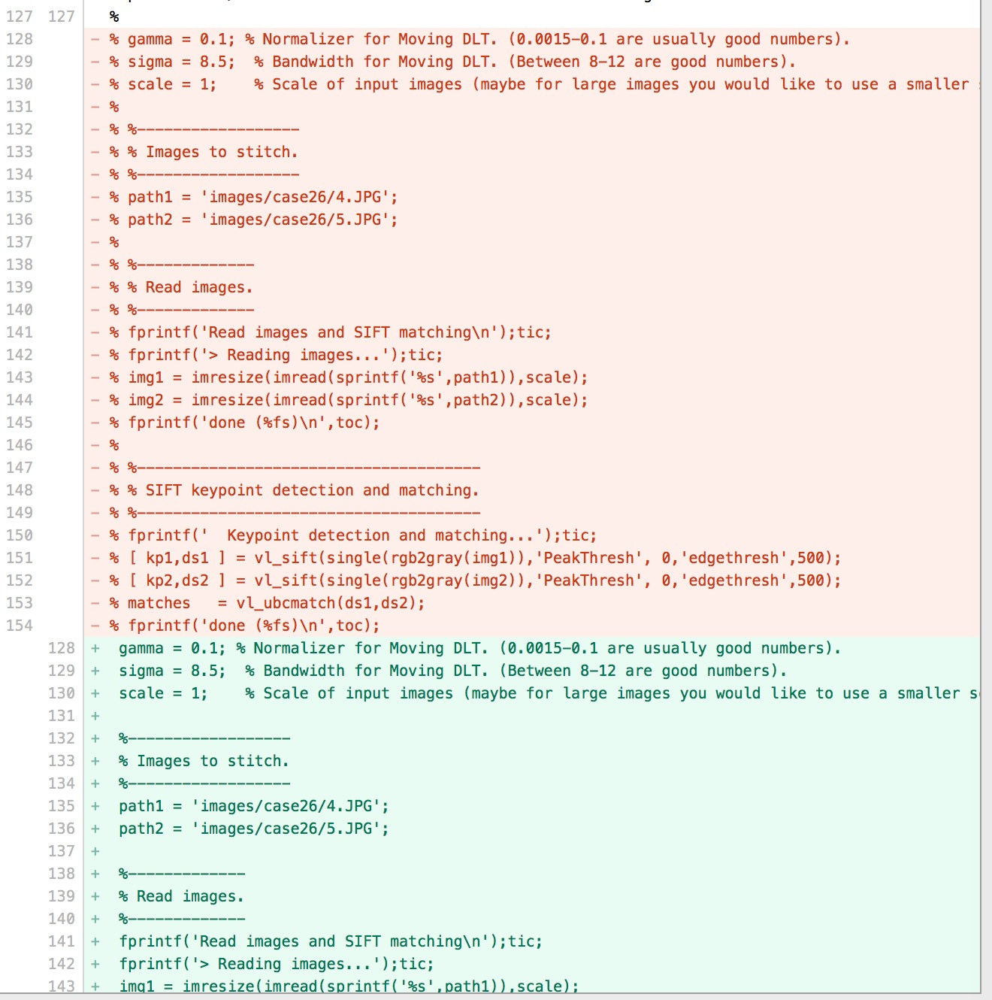
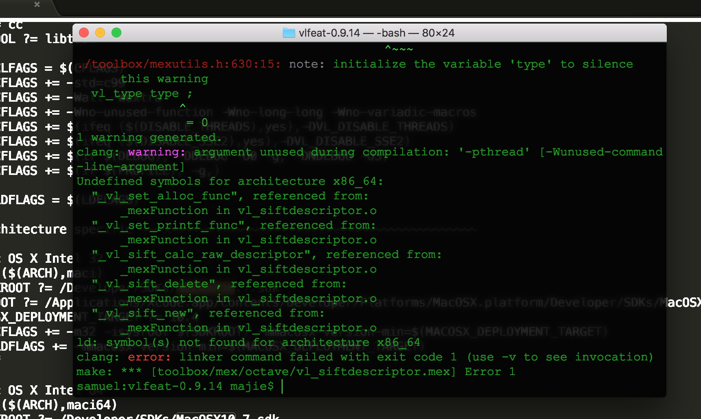
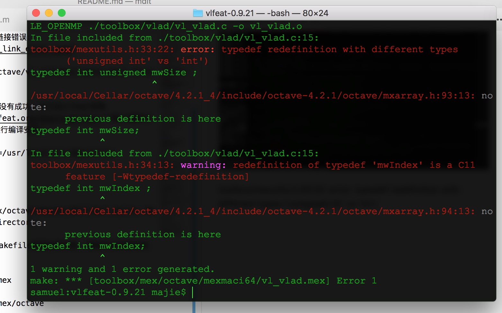
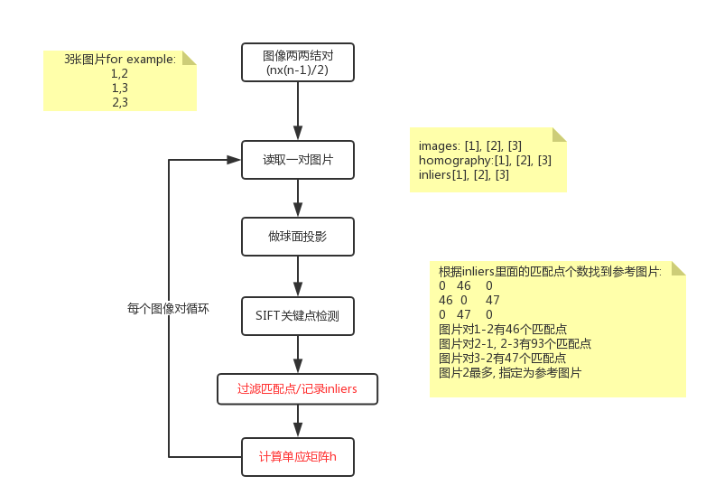

# soccercv


## 1. 在mac上面搭建open cv的开发环境

### 1.1 现有的环境
```
python --version: Python 2.7.10
which python: /usr/bin/python
python3 --version: Python 3.5.0
which python3: /usr/local/bin/python3
```

### 1.2 open cv的示例需要哪个版本?

没看出来哪个版本(结果参考下面的文档可同时安装两个版本)

### 1.3 错误处理

参考[pyimagesearch](http://www.pyimagesearch.com/2016/12/19/install-opencv-3-on-macos-with-homebrew-the-easy-way/)最后还是不行, 报错: "No module named 'cv2'""

echo $PATH发现我的python3有两个路径, 把其中的/Library/Frameworks/Python.framework/Versions/3.5/lib/python3.5路径去掉就好了(注意: 开始我没发现, 又pip3 install opencv-python了一下, 结果运行报告"highgui/src/window.cpp error: (-2) The function is not implemented"错误, 后来找到路径错误, 运行pip3 uninstall opencv-python才可以工作了)

### 1.4 imutils安装的问题

我已经调用pip安装了imutils: 
```
pip3 install imutils
```
但是运行Auto Stitch的demo的时候, 仍然提示我:
```
No module named 'imutils'
```
查看pip3:
``` 
which pip3
/usr/local/bin/pip3
pip3 --version
pip 9.0.1 from /usr/local/lib/python3.6/site-packages (python 3.6)
```
查看python3:
```
which python3
/usr/local/bin/python3
python3
Python 3.5.0 (v3.5.0:374f501f4567, Sep 12 2015, 11:00:19) 
[GCC 4.2.1 (Apple Inc. build 5666) (dot 3)] on darwin
Type "help", "copyright", "credits" or "license" for more information.
print(sys.path)
```
发现package的路径是3.5, 而pip3使用的是3.6, 难怪呢.

我的系统里面有3.5, 还有3.6:
/usr/local/bin/python3
/usr/local/Cellar/python3/3.6.4_2/bin/python3
那怎么办呢? 
1. 直接使用全路径的方式, 发现无法使用cv2
2. 把pip3降低版本到3.5? 我的pip3是安装python的时候自动安装的, 不知道为啥就给安装成了3.6版本的.
3. 可以把imutils拷贝到3.5的packages吧: 
/usr/local/lib/python3.6/site-packages (python 3.6)
/usr/local/opt/opencv3/lib/python3.5/site-packages
嗯, 可以使用了. [参考资料](https://qinjiangbo.com/solve-problem-that-python3-cannot-load-modules-pip3-installed.html)


### 1.5 c++, xcode开发环境

主要问题就是设置路径.
设置头文件路径:
```
进入“Build Settings”选项卡，在“Header Search Paths”栏中输入：“/usr/local/include
```
设置opencv动态库的路径:
```
进入“Build Settings”选项卡，在“Library Search Paths”栏中输入“xxx/release/lib”, 注意这是opencv安装编译时的release路径.
```

链接opencv动态库:
```
Build Phases -> Link Binary With Librarys, 添加'xxx/release/lib'路径下的各个模块的dylib[注意别加链接文件]
```
然后就可以使用了.


### 1.6 测试数据
测试数据目录[data](https://pan.baidu.com/s/1MnW3RwZFIXs4AFUEREw9fw)放在百度网盘, 下载放在根目录下就可以使用了.


## 2. 用APAP进行图像拼接
参考知乎大神[YaqiLYU的文章](
https://www.zhihu.com/question/34535199)
下载了[APAP(As Projective As Possible)](https://cs.adelaide.edu.au/~tjchin/apap/)的源代码, 发现在我的开发环境下(Mac + octave)跑不起来, 答应我家旦旦要给他做一个有两个旦旦画画的图片, 于是折腾了两个早上, 总算跑起来了, 效果不错.解决的问题有如下几个:

### 2.1 octave对matlib兼容问题

matlabpool在octave中不支持, 应该是有其他的方式, 我这里直接注释掉


rng(0)也有同样的问题, 换成了rand('seed', 0)


svd(A)的精简版本svd(A, 0)在octave中有问题, 直接换成了svd(A), 不用精简版本.


### 2.2 缺少包的问题
```
error: 'randsample' undefined
```

需要安装image和statistics库.
```
pkg install -forge statistics
pkg install -forge image
```
然后在进入octave之后, 加载image和statistics库:
```
octave:1>pkg load image
octave:2>pkg load statistics
```
再运行main.
```
octave:3>main
```
这样就跑通了, 可以看到效果如图.

### 2.3 拼接自定义的图片
demo中的图片是直接读取matlib的mat数据文件, 可是我需要拼接自己的图片, 需要修改下面这个地方, main.m文件中已经写好了.只要注释掉上面的部分, 打开下面的部分就可以了.


注意加载的路径:
```
images/case26/4.JPG
images/case26/5.JPG
```
换成自己要拼接的图片路径.

再运行main, 会报错:
```
Keypoint detection and matching...error: invalid use of script /xxx/./vlfeat-0.9.14/toolbox/sift/vl_sift.m in index expression
```

查看对应目录下的vl_sift.m文件确实都是注释没有代码, 原因是拼接自己的图片需要使用vlfeat库, 而vlfeat库没有安装好(如果安装好, 会调用编译好的mex文件而不是这个源文件).

### 2.4 编译vlfeat

那就为mac + octave环境编译vlfeat吧, 进入vlfeat-0.9.14目录, 执行make:
```
make MKOCTFILE=/usr/local/bin/mkoctfile ARCH=maci64
```

提示路径不对: /Developer/SDKs/MacOSX10.7.sdk

修改Makefile把这个路径改成本地的XCode的路径
:
```
/Applications/Xcode.app/Contents/Developer/Platforms/MacOSX.platform/Developer/SDKs/MacOSX.sdk
```
再进行编译, 提示链接错误:

```
make: *** [toolbox/mex/octave/vl_siftdescriptor.mex] Error 1
```
然后各种google都没有成功, 自己去[vlfeat官网](http://www.vlfeat.org/download.html)下载了最新的0.9.21版本, 再进行编译安装:
```
make MKOCTFILE=/usr/local/bin/mkoctfile ARCH=maci64
```
报错:
```
cp: toolbox/mex/octave/mexmaci64/libvl.dylib: No such file or directory
```
我不知道该怎么在Makefile里面创建目录, 那就手动创建目录好了:
```
mkdir toolbox/mex
mkdir toolbox/mex/octave
mkdir toolbox/mex/octave/mexmaci64
```

再编译报错:


toolbox/mexutils.h:33:22: error: typedef redefinition with different types
      ('unsigned int' vs 'int')

修改mexutils.h中的定义, 把int unsigned改成int, 再编译安装, 终于成功了!!!

### 2.5 其他编译错误
```
wsvd undefined
```
wsvd是自定义的函数, 这个错误是没有编译源文件wsvd.cpp, 可以参考mdlt项目中的main.m编译一下即可:
```
if exist('wsvd','file')~=3
    mex ../wsvd.cpp;
end
```
或者直接把结果拷贝过来使用.


### 2.6 admdtl流程




## 3. 拼接两个.mov视频文件

打算先并排用两个手机录制视频, 然后拼接这两个视频, 首先要解决的帧对齐问题, 打算用时间戳来进行对齐.

### 3.1 获取mov文件的创建时间
这里说的创建时间并不是文件的创建时间, 而是写入多媒体文件的exif信息, 里面包含多媒体文件的创建时间, 创建的地点经度纬度等.google发现有libexif和exiv2两个开源库可以使用, exiv2是c++的, 所以选用这个库.到[github](https://github.com/Exiv2/exiv2)下载源代码进行编译, 注意在config的时候要打开对video的支持.
```
make config
./configure --enable-video=yes
make
sudo make install
```
安装成功后就可以使用Exiv2库读取mov文件的exif信息了.
引用头文件:
```
...
#include <exiv2/quicktimevideo.hpp>
...
```
读取mov文件
```
...
BasicIo::AutoPtr data = ImageFactory::createIo(fname);
...
```
用文件生成QuickTimeVideo对象:
```
...
QuickTimeVideo *video = new QuickTimeVideo(data);
...
```
然后就可以读取tag信息了.
```
...
video->readMetadata();
XmpData xmp = video->xmpData();
for (Exiv2::XmpData::const_iterator md = xmp.begin(); md != xmp.end(); ++md)
{
    //md->key();
    //md->typeName();
    //md->value()
    ...
}
...
```
具体代码参考SSMeta.cpp文件中的getVideoTime函数.注意得到的是UTC, 格式是年月日时分秒+TimeZone信息[参考](https://www.w3.org/TR/NOTE-datetime)

这里有个有趣的事情, 我根据读取到的秒数转换成可读日期是这样的:
```
Sat Feb  5 14:52:49 2084
```
时间是对的, 但是日期和年是不对的, 应该是2018年, 为啥搞到2084年去了, google了半天才发现, 原来这个秒数不是从1970年开始的, 而是1904年, 那么为啥是1904年而不是1900年呢, 这里面有个故事:
UTC时间是1970年1月1日0时0分0秒算起的秒数.

微软的excel支持两个版本: 1900 date system和1904 date system, 因为他的早期竞争对手Lotus1-2-3用的是1900 date syste, 所谓的1900 date system是指记录从1900年1月1日0时开始的整数.

```
...
Because of the design of early Macintosh computers, dates before January 1, 1904 were not supported. This design was intended to prevent problems related to the fact that 1900 was not a leap year.
...
```
这里有一段话是说Macintosh使用的是1904年1月1日作为基准时间, 原因是1900年不是一个闰年.
两个date system相差4年1天(1,462 days).
早期的Macintosh需要支持130年的范围, 而生日从19xx年也就是20世纪开始, 到21世纪的200年里, 能被4整除但是不是闰年的只有1900年, 所以没有用1900年作为epoch, 又因为1900年后1904年是第一个leap year, 所以用的是1904年1月1日作为epoch.

而1900年不是闰年(leap year)Microsoft的excel是怎么处理的呢? 他们不处理, 因此输入1900年2月29日是合法的, 为毛犯这样的错误呢? 为了兼容对手的错误, excel的对手是Lotus1-2-3, 而Lotus有这个问题, 所以microsoft明知道有bug也全盘保留了.

那为毛Lotus会有这个bug呢? 他们的工程师太二吗?非也.
```
...
“Yeah, but probably an intentional one. Lotus had to fit in 640K. That’s not a lot of memory. If you ignore 1900, you can figure out if a given year is a leap year just by looking to see if the rightmost two bits are zero. That’s really fast and easy.
...
```

### 3.2 opencv中的Stitch
对于图像拼接, opencv提供了2种使用方式, 封装好的[Stitcher](https://docs.opencv.org/3.2.0/d8/d19/tutorial_stitcher.html)类和自定义各个环节的[Stitch detail](https://github.com/opencv/opencv/blob/master/samples/cpp/stitching_detailed.cpp).既然这样, 那我可以参考detail来做我自己的stitcher了.

### 3.3 还是时间戳的问题
我用3台手机录制了3份mov视频文件, 结果中间的2.mov文件时间戳竟然丢失了, 显示的创建时间是1970年1月1日, 我看来一下手机时间是正常的, 再录制新的视频时间戳也是对的, 这个为啥就丢失了呢?原因还没找到. 不过这说明用时间戳进行video align的方式在很多情况下是行不通的. 为此打算设计一个逐帧对齐的方案来进行video align.

